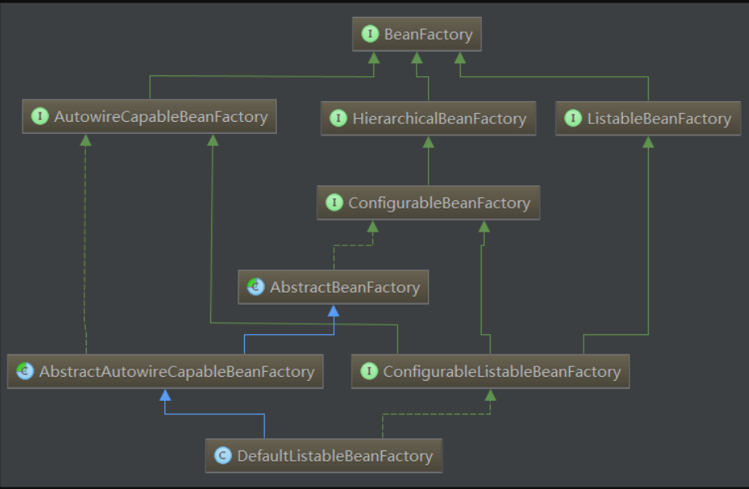
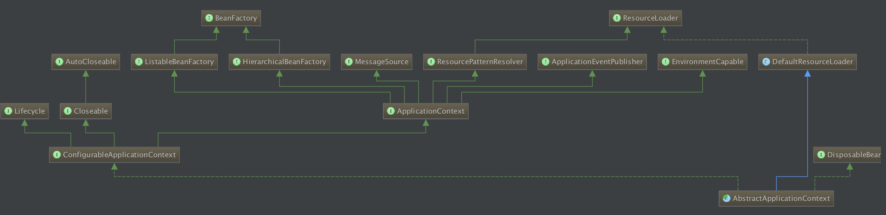
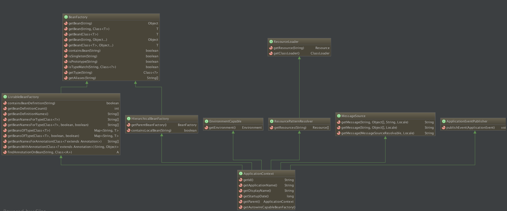

# Spring容器、BeanFactory和applicationcontext

图中实线为继承extends，虚线为实现implements

## 一、spring容器的理解

spring容器可以理解为生产对象（OBJECT）的地方，在这里容器不只是帮我们创建了对象那么简单，它负责了对象的整个生命周期--创建、装配、销毁。而这里对象的创建管理的控制权都交给了Spring容器，所以这是一种控制权的反转，称为**IOC容器**，而这里IOC容器不只是Spring才有，很多框架也都有该技术。

## 二、BeanFactory和ApplicationContext之间的关系

- BeanFactory和ApplicationContext是Spring的两大核心接口，而其中ApplicationContext是BeanFactory的子接口。它们都可以当做Spring的容器，Spring容器是生成Bean实例的工厂，并管理容器中的Bean。在基于Spring的Java EE应用中，所有的组件都被当成Bean处理，包括数据源，Hibernate的SessionFactory、事务管理器等。
- 生活中我们一般会把生产产品的地方称为工厂，而在这里bean对象的地方官方取名为BeanFactory，直译Bean工厂（com.springframework.beans.factory.BeanFactory），我们一般称BeanFactory为IoC容器，而称ApplicationContext为应用上下文。
- Spring的核心是容器，而容器并不唯一，框架本身就提供了很多个容器的实现，大概分为两种类型：
   一种是不常用的BeanFactory，这是最简单的容器，只能提供基本的DI功能；
   一种就是继承了BeanFactory后派生而来的ApplicationContext(应用上下文)，它能提供更多企业级的服务，例如解析配置文本信息等等，这也是ApplicationContext实例对象最常见的应用场景。

## 三、BeanFactory详情介绍

Spring容器最基本的接口就是BeanFactory。BeanFactory负责配置、创建、管理Bean，它有一个子接口ApplicationContext，也被称为Spring上下文，容器同时还管理着Bean和Bean之间的依赖关系。
 **spring Ioc容器的实现，从根源上是beanfactory，但真正可以作为一个可以独立使用的ioc容器还是DefaultListableBeanFactory，因此可以这么说，
 *DefaultListableBeanFactory* 是整个spring ioc的始祖。**



> ### 接口介绍：
>
> **1.BeanFactory接口：**
>  是Spring bean容器的根接口，提供获取bean，是否包含bean,是否单例与原型，获取bean类型，bean 别名的方法 。它最主要的方法就是getBean(String beanName)。
>  **2.BeanFactory的三个子接口：**
>  \* HierarchicalBeanFactory：提供父容器的访问功能
>  \* ListableBeanFactory：提供了批量获取Bean的方法
>  \* AutowireCapableBeanFactory：在BeanFactory基础上实现对已存在实例的管理
>  **3.ConfigurableBeanFactory：**
>  主要单例bean的注册，生成实例，以及统计单例bean
>  **4.ConfigurableListableBeanFactory：**
>  继承了上述的所有接口，增加了其他功能：比如类加载器,类型转化,属性编辑器,BeanPostProcessor,作用域,bean定义,处理bean依赖关系, bean如何销毁…
>  **5.实现类DefaultListableBeanFactory[详细介绍](https://www.cnblogs.com/sten/p/5758161.html)：**
>  实现了ConfigurableListableBeanFactory，实现上述BeanFactory所有功能。它还可以注册BeanDefinition

## 四、ApplicationContext介绍

如果说BeanFactory是Sping的心脏，那么ApplicationContext就是完整的身躯了。





|     ApplicationContext常用实现类      |                             作用                             |
| :-----------------------------------: | :----------------------------------------------------------: |
|  AnnotationConfigApplicationContext   | 从一个或多个基于java的配置类中加载上下文定义，适用于java注解的方式。 |
|    ClassPathXmlApplicationContext     | 从类路径下的一个或多个xml配置文件中加载上下文定义，适用于xml配置的方式。 |
|    FileSystemXmlApplicationContext    | 从文件系统下的一个或多个xml配置文件中加载上下文定义，也就是说系统盘符中加载xml配置文件。 |
| AnnotationConfigWebApplicationContext |            专门为web应用准备的，适用于注解方式。             |
|       XmlWebApplicationContext        | 从web应用下的一个或多个xml配置文件加载上下文定义，适用于xml配置方式。 |

Spring具有非常大的灵活性，它提供了三种主要的装配机制：

- 1.在XMl中进行显示配置
- 2.在Java中进行显示配置
- 3.隐式的bean发现机制和自动装配
   *组件扫描（component scanning）：Spring会自动发现应用上下文中所创建的bean。
   *自动装配（autowiring）：Spring自动满足bean之间的依赖。

（使用的优先性: 3>2>1）尽可能地使用自动配置的机制，显示配置越少越好。当必须使用显示配置bean的时候（如：有些源码不是由你来维护的，而当你需要为这些代码配置bean的时候），推荐使用类型安全比XML更加强大的JavaConfig。最后只有当你想要使用便利的XML命名空间，并且在JavaConfig中没有同样的实现时，才使用XML。

1. 通过xml文件将配置加载到IOC容器中


```xml
<?xml version="1.0" encoding="UTF-8"?>
<beans xmlns="http://www.springframework.org/schema/beans"
       xmlns:xsi="http://www.w3.org/2001/XMLSchema-instance"
       xsi:schemaLocation="http://www.springframework.org/schema/beans http://www.springframework.org/schema/beans/spring-beans.xsd">
     <!--若没写id，则默认为com.test.Man#0,#0为一个计数形式-->
    <bean id="man" class="com.test.Man"></bean>
</beans>
```


```java
public class Test {
    public static void main(String[] args) {
        //加载项目中的spring配置文件到容器
        //ApplicationContext context = new ClassPathXmlApplicationContext("resouces/applicationContext.xml");
        //加载系统盘中的配置文件到容器
        ApplicationContext context = new FileSystemXmlApplicationContext("E:/Spring/applicationContext.xml");
        //从容器中获取对象实例
        Man man = context.getBean(Man.class);
        man.driveCar();
    }
}
```

1. 通过java注解的方式将配置加载到IOC容器


```java
//同xml一样描述bean以及bean之间的依赖关系
@Configuration
public class ManConfig {
    @Bean
    public Man man() {
        return new Man(car());
    }
    @Bean
    public Car car() {
        return new QQCar();
    }
}
```


```java
public class Test {
    public static void main(String[] args) {
        //从java注解的配置中加载配置到容器
        ApplicationContext context = new AnnotationConfigApplicationContext(ManConfig.class);
        //从容器中获取对象实例
        Man man = context.getBean(Man.class);
        man.driveCar();
    }
}
```

1. 隐式的bean发现机制和自动装配


```java
/**
 * 这是一个游戏光盘的实现
 */
//这个简单的注解表明该类回作为组件类，并告知Spring要为这个创建bean。
@Component
public class GameDisc implements Disc{
    @Override
    public void play() {
        System.out.println("我是马里奥游戏光盘。");
    }
}
```

不过，组件扫描默认是不启用的。我们还需要显示配置一下Spring，从而命令它去寻找@Component注解的类，并为其创建bean。


```java
@Configuration
@ComponentScan
public class DiscConfig {
}
```

我们在DiscConfig上加了一个@ComponentScan注解表示在Spring中开启了组件扫描，默认扫描与配置类相同的包，就可以扫描到这个GameDisc的Bean了。这就是Spring的自动装配机制。

------

**除了提供BeanFactory所支持的所有功能外ApplicationContext还有额外的功能**

- 默认初始化所有的Singleton，也可以通过配置取消预初始化。
- 继承MessageSource，因此支持国际化。
- 资源访问，比如访问URL和文件。
- 事件机制。
- 同时加载多个配置文件。
- 以声明式方式启动并创建Spring容器。

> 注：由于ApplicationContext会预先初始化所有的Singleton Bean，于是在系统创建前期会有较大的系统开销，但一旦ApplicationContext初始化完成，程序后面获取Singleton Bean实例时候将有较好的性能。也可以为bean设置lazy-init属性为true，即Spring容器将不会预先初始化该bean。